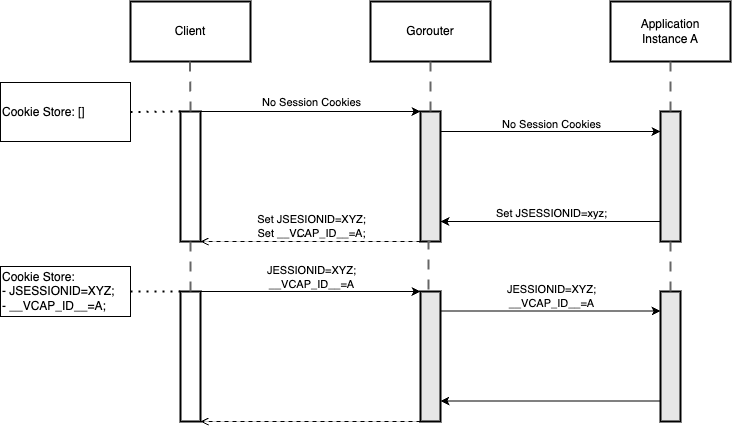
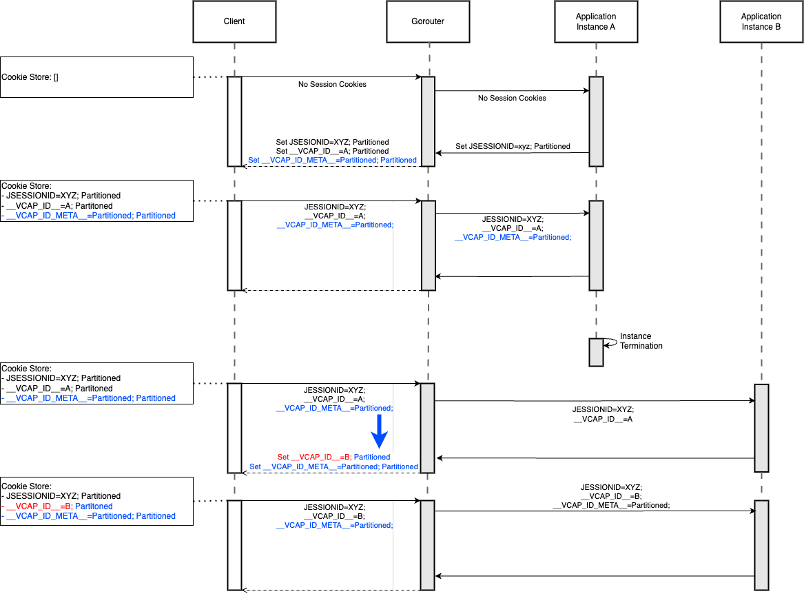
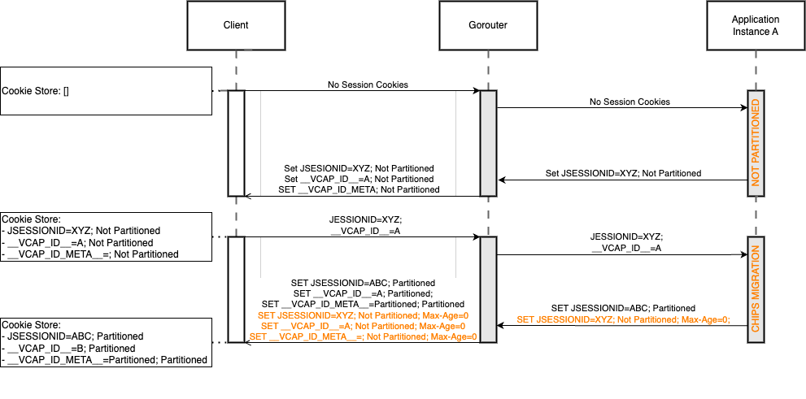

# How To Use Session Affinity

## What is it?
Session affinity, also known as sticky sessions, enables requests from a
particular client to consistently reach the same application instance when multiple
app instances are deployed. This allows applications to store data specific to a user
session in memory without requiring external session storage.

## Architecture

Sticky sessions are initiated by applications by setting a sticky session cookie in the
response. The default sticky session cookie name is `JSESSIONID`. You can configure
additional cookie names that the routing tier recognizes for sticky sessions by editing
the `router.sticky_session_cookie_names` configuration key in the deployment manifest.

When Gorouter receives a response from an application with a `JSESSIONID` cookie (or other
configured sticky session cookie), Gorouter creates a `__VCAP_ID__` + `__VCAP_ID_META__`
cookie pair for each matching session cookie in the response. The `__VCAP_ID__` cookie
contains the instance GUID of the responding application and inherits all relevant attributes
from the corresponding `JSESSIONID` cookie, including `Max-Age`, `Expires`, `SameSite`,
`Secure`, and `Partitioned`. This per-cookie translation is important during a
[CHIPS migration](#how-does-gorouter-support-chips-cookie-migration), where an application may
set multiple session cookies with the same name in a single response.

The companion `__VCAP_ID_META__` cookie stores the attributes of the session (such as `Secure`,
`SameSite`, and expiry) so they can be restored if the application instance becomes unavailable
and the application does not set a new `JSESSIONID` cookie on the replacement instance. See
[`__VCAP_ID_META__`](#what-is-the-__vcap_id_meta__-cookie) for details.

In subsequent requests, the client sends the `__VCAP_ID__`, `__VCAP_ID_META__`, and
`JSESSIONID` cookies (web browsers do this automatically). Gorouter uses the `__VCAP_ID__`
cookie to forward the request to the same application instance that originally set the
session cookie.

## Try it out!
Using the example [Dora app](https://github.com/cloudfoundry/cf-acceptance-tests/tree/db3503add82d01163318d5d1c5f30603efb81055/assets/dora#sticky-sessions),
you can try sticky sessions for yourself!

## FAQ

### What happens when the app instance GUID in the `__VCAP_ID__` cookie is no longer valid?
If the application instance referenced by the `__VCAP_ID__` cookie no longer exists (e.g., due to
scaling down or instance restart), Gorouter will route the request to another available instance
of the same application and update the `__VCAP_ID__` cookie to point to the new instance.

If the application responds with a new `JSESSIONID` cookie, the `__VCAP_ID__` cookie attributes
are taken from that new `JSESSIONID` cookie. If the application does not set a new `JSESSIONID`
cookie, the original cookie attributes (`Secure`, `SameSite`, `Partitioned`, and expiry lifetime)
are preserved from the previous session via the `__VCAP_ID_META__` metadata cookie (see
[`__VCAP_ID_META__`](#what-is-the-__vcap_id_meta__-cookie) below).

### What is the `__VCAP_ID_META__` cookie?
When Gorouter sets a `__VCAP_ID__` cookie (because the application set a sticky session cookie),
Gorouter also sets an additional metadata cookie named `__VCAP_ID_META__`. The `__VCAP_ID__`
cookie itself inherits its attributes (`Expires`, `Max-Age`, `SameSite`, `Secure`, `Partitioned`)
directly from the `JSESSIONID` cookie — see
[What cookie attributes does `__VCAP_ID__` inherit from `JSESSIONID`?](#what-cookie-attributes-does-__vcap_id__-inherit-from-jsessionid)
for the full details.

This metadata cookie preserves the attributes of the `__VCAP_ID__` cookie so they can be
reproduced on a stale instance refresh. Since cookie attributes are never sent from the client
to the server, Gorouter cannot otherwise determine the original `Secure`, `SameSite`,
`Partitioned`, or expiry attributes of the existing `__VCAP_ID__` cookie.

The `__VCAP_ID_META__` cookie value is a `&`-separated list of attributes encoding the
relevant cookie properties. Boolean attributes are encoded as bare keys, while other attributes
use `key=value` pairs. For example: `secure&partitioned&samesite=strict&expires=1703001600&maxage=1703001600`.
Both `expires` and `maxage` store absolute Unix timestamps rather than the original relative
values, so that the remaining lifetime can be computed correctly on each stale instance refresh
without extending the original session lifetime.

This is particularly relevant in the stale instance scenario: when the application instance
referenced by `__VCAP_ID__` is no longer available and the new instance does not set a new
`JSESSIONID` cookie, Gorouter reads the preserved attributes from `__VCAP_ID_META__` and
applies them to the refreshed `__VCAP_ID__` cookie.

The `__VCAP_ID_META__` cookie is issued with the same attributes as `__VCAP_ID__` (same
lifecycle, same `Secure`, same `SameSite`, same `Partitioned`) to ensure they co-expire
and share the same security constraints.

### How does Gorouter support CHIPS cookie migration?

[CHIPS (Cookies Having Independent Partitioned State)](https://developers.google.com/privacy-sandbox/cookies/chips)
is a browser initiative that requires third-party cookies to use the `Partitioned` attribute.
When an application migrates from non-partitioned to partitioned session cookies, it typically
sets **two** `JSESSIONID` cookies in a single response during the transition:

1. A new **partitioned** `JSESSIONID` — establishing the new partitioned session.
2. A **non-partitioned** `JSESSIONID` with `Max-Age=0` — deleting the old non-partitioned
   cookie from the browser.

Gorouter translates **each** `JSESSIONID` cookie in the response into its own
`__VCAP_ID__` + `__VCAP_ID_META__` pair, preserving the per-cookie attributes (`Partitioned`,
`SameSite`, `Max-Age`, etc.). This ensures the browser receives the correct delete instruction
for the old non-partitioned `__VCAP_ID__` cookie alongside the new partitioned one.

### Does Gorouter support `__Host-` prefixed session cookies?
Yes. [RFC 6265bis](https://datatracker.ietf.org/doc/draft-ietf-httpbis-rfc6265bis/) defines
the `__Host-` cookie prefix, which instructs browsers to enforce additional security constraints
(the cookie must be `Secure`, must not specify a `Domain`, and the `Path` must be `/`).

Gorouter recognises cookies that use the exact `__Host-` prefix (case-sensitive, matching the
canonical casing mandated by the RFC) in front of a configured sticky session cookie name. For
example, if `JSESSIONID` is configured as a sticky session cookie name, Gorouter will also
recognise `__Host-JSESSIONID` as a sticky session cookie — both in application responses (to
create the `__VCAP_ID__` + `__VCAP_ID_META__` pair) and in client requests (to route to the
sticky backend).

No additional configuration is required; the `__Host-` prefix is handled automatically for every
name listed in `router.sticky_session_cookie_names`.

### What happens when both `JSESSIONID` and `__Host-JSESSIONID` are in the same response?
Gorouter creates a `__VCAP_ID__` + `__VCAP_ID_META__` pair for each session cookie — the same
behaviour as [CHIPS migration](#how-does-gorouter-support-chips-cookie-migration). Since both
`__VCAP_ID__` cookies share the same name and (unless one is `Partitioned`) the same browser
cookie jar slot, the browser will only retain the last one.

In practice this is not a concern: unlike CHIPS migration, there is no need to set both cookies in
the same response. Because `JSESSIONID` and `__Host-JSESSIONID` are distinct cookie names in the
browser's jar, the expected migration path is for the application to simply stop setting
`JSESSIONID` and start setting `__Host-JSESSIONID` — the old cookie expires naturally.

Note: if an application were to set a new `__Host-JSESSIONID` alongside a delete (`Max-Age=0`) for
the old `JSESSIONID` in the same response, both would produce a `__VCAP_ID__` in the same cookie
jar partition. Depending on processing order, the browser could apply the delete `__VCAP_ID__`
after the new one, effectively removing it. Developers should therefore avoid setting both cookies
in the same response to prevent temporarily losing session stickiness.

### What happens if only one of `JSESSIONID` or `__VCAP_ID__` cookies is set on a request?
Gorouter requires both `JSESSIONID` and `__VCAP_ID__` to be present for sticky session routing.
If only one of them is present, Gorouter will route the request to a random available application
instance. The `__VCAP_ID_META__` cookie is not required for routing, but its absence means that
attribute preservation on stale instance refresh is not possible (see
[`__VCAP_ID_META__`](#what-is-the-__vcap_id_meta__-cookie)).

### What if an application sets its own `__VCAP_ID__` cookie?
If the application response already contains a `__VCAP_ID__` cookie, Gorouter will not add another
one. The application's `__VCAP_ID__` cookie will be forwarded to the client as-is. This allows
applications to have full control over the sticky session cookie if needed.

### Does Gorouter support sticky sessions with Negotiate authentication (Kerberos/SPNEGO)?
Yes. When the `router.sticky_sessions_for_auth_negotiate` BOSH property is enabled, Gorouter will
automatically create sticky sessions for responses containing a `WWW-Authenticate: Negotiate` header.
This ensures that Kerberos/SPNEGO authentication handshakes complete successfully by routing
subsequent requests to the same application instance.

In this case, Gorouter sets the `__VCAP_ID__` cookie with predefined attributes (`Max-Age` and
`SameSite=Strict`) since there is no `JSESSIONID` cookie to inherit attributes from.

### How is the `X-CF-App-Instance` header different from sticky sessions?
The `X-CF-App-Instance` header allows routing to a specific app instance _index_ (e.g., the 3rd
instance). This is useful for debugging specific instances but is meant only for testing and
debugging scenarios. Sticky sessions, on the other hand, are meant for production use and route
based on instance GUID, allowing automatic failover when an instance becomes unavailable. See
[these docs](https://docs.cloudfoundry.org/concepts/http-routing.html#app-instance-routing) for
more information.

### Is `vcap_request_id` related to sticky sessions?
No. The `vcap_request_id` header is a random GUID set by Gorouter on every request for tracing
and correlation purposes. Despite the naming similarity, it is not related to the `__VCAP_ID__`
cookie used for sticky sessions.

### What happens when I restart my browser?
This depends on the cookie lifecycle attributes `Expires` and `Max-Age`. When the `JSESSIONID` cookie 
does not specify `Max-Age` or `Expires`, all three cookies are treated as session cookies and will 
expire when the browser is closed, ending the session.

Gorouter copies these cookie attributes from the `JSESSIONID` cookie to both the `__VCAP_ID__` and 
`__VCAP_ID_META__` cookies, so all three cookies share the same lifecycle.

When either attribute is specified, both cookies will expire based on the configured lifetime.
Note that `Max-Age` takes precedence over `Expires` per the HTTP cookie specification.

### How can I use a route service (a platform-deployed reverse proxy) in front of an application that relies on sticky sessions?
Sticky sessions work correctly with both platform-deployed Cloud Foundry route services and
externally deployed route services. The `__VCAP_ID__` cookie is properly forwarded through
the route service chain.

### What cookie attributes does `__VCAP_ID__` inherit from `JSESSIONID`?
Each `__VCAP_ID__` cookie inherits its attributes from the corresponding `JSESSIONID` cookie in the
response. When multiple `JSESSIONID` cookies are present (e.g., during a
[CHIPS migration](#how-does-gorouter-support-chips-cookie-migration)), each one gets its own
`__VCAP_ID__` + `__VCAP_ID_META__` pair with independently inherited attributes.
[See implementation](https://github.com/cloudfoundry/routing-release/blob/e9683b43dec98ee211390c28cc8611d6869de801/src/code.cloudfoundry.org/gorouter/proxy/round_tripper/proxy_round_tripper.go#L508-L512).

#### Expires, SameSite, Max-Age, Partitioned
These attributes are always copied directly from the `JSESSIONID` cookie to the `__VCAP_ID__` cookie
without modification.

When the `JSESSIONID` cookie has the `Partitioned` attribute, Gorouter sets both `__VCAP_ID__`
and `__VCAP_ID_META__` with the `Partitioned` attribute as well.

#### Secure
The `Secure` attribute on the `__VCAP_ID__` cookie is controlled by two factors:
1. The `Secure` attribute on the `JSESSIONID` cookie set by the application
2. The value of the [`router.secure_cookies`](https://github.com/cloudfoundry/routing-release/blob/f03f47b1dfe43a90e0717afd0d111e017e8d0fe1/jobs/gorouter/spec#L67-L69) BOSH property

The behavior is as follows:

| `router.secure_cookies` | `JSESSIONID` is secure? | `__VCAP_ID__` is secure? |
|-------------------------|-------------------------|--------------------------|
| false                   | true                    | true                     |
| false                   | false                   | false                    |
| true                    | true                    | true                     |
| true                    | false                   | true                     |

When `router.secure_cookies` is set to `true`, the `__VCAP_ID__` cookie will always be secure,
regardless of the application's `JSESSIONID` cookie settings.
